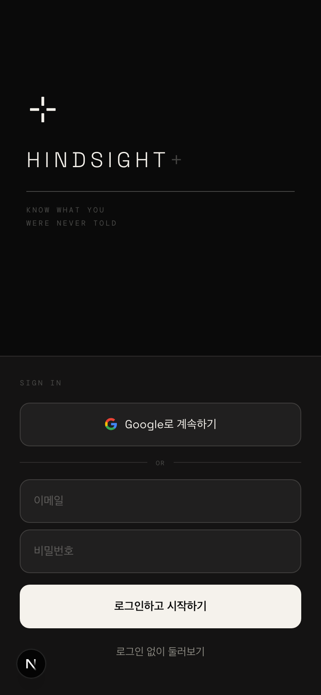
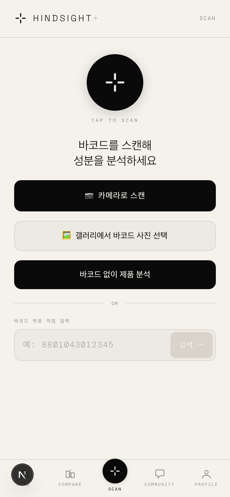
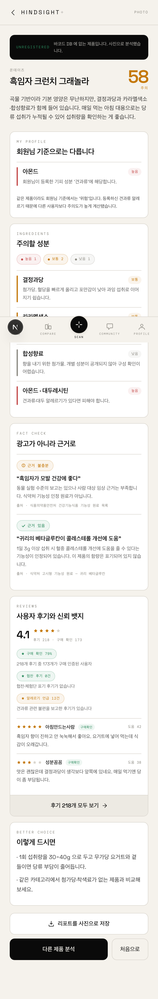
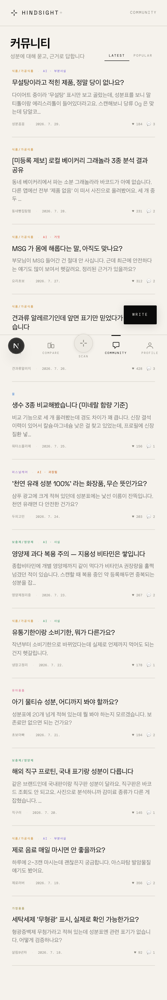
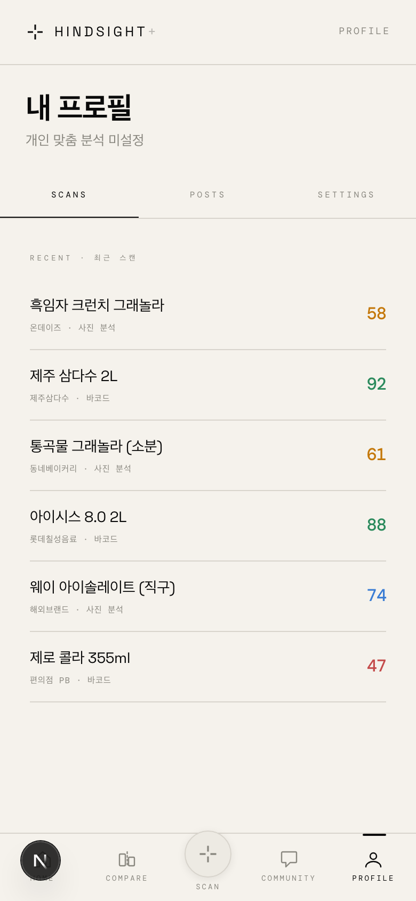

# HINDSIGHT+

**포장지 뒷면을 대신 읽어주는 성분 분석 앱**

바코드를 찍거나 성분표를 사진으로 찍으면, 원재료를 판독해 점수와 근거를 보여줍니다.
광고 문구가 아니라 **감점 내역으로** 설명합니다.

🔗 **배포:** https://hindsight-khaki.vercel.app

> 국민대학교 **SYNC 연합학술제** 출품작 (경영학부 · KIBS · 소프트웨어학부)

---

## 왜 만들었나

식품 포장 앞면은 마케팅 공간입니다. "무설탕", "천연", "프로틴 가득" — 정작 판단에 필요한
정보는 뒷면 6pt 글씨에 있고, `혼합제제(구연산, 향료)` 같은 표기는 읽어도 뜻을 모릅니다.

기존 성분 분석 앱은 **바코드 DB에 등록된 제품만** 볼 수 있습니다. 그런데 실제로 궁금한 건
동네 베이커리 소분 그래놀라, 직구 프로틴, 신제품처럼 **DB에 없는 것들**입니다.

HINDSIGHT+는 바코드가 없어도 **사진 한 장으로** 분석합니다.

---

## 핵심 원칙 — 판독과 판정을 분리한다

```
사진 → [Claude Vision] 판독만 → JSON → [규칙 기반 코드] 점수 → 화면
        모델이 하는 일               LLM 아님, 결정적
```

한 번의 LLM 호출로 점수까지 내면 모델이 숫자를 지어내고, **"왜 58점인가"를 설명할 수 없습니다.**

그래서 모델에게는 *"사진에 뭐라고 적혀 있는가"* 만 시키고, 점수는 코드가 계산합니다.
덕분에 **같은 사진은 항상 같은 점수**가 나오고, 모든 감점에 근거가 붙습니다.

### 점수 계산식

```
최종점수 = min(신뢰상한, clamp(0, 100 − 영양감점 − 주의성분감점 − 미확인첨가물감점))
```

**신뢰상한이 왜 있나.** 감점만으로 점수를 내면 **아는 게 없을수록 점수가 올라갑니다.**
실제로 불닭소스를 찍었을 때 원재료 36건 중 확인 0건, 영양성분 3개 모두 판독 실패로
**감점 0 + 감점 0 = 100점 "안전"** 이 나왔습니다. 정보 부족이 안전의 증거가 된 셈입니다.

감점과 상한은 다른 종류의 진술입니다.

| | 뜻 | 근거가 필요한 것 |
|---|---|---|
| 감점 | "이만큼 나쁘다" | 실제로 읽은 값 |
| 상한 | "이 이상은 주장할 수 없다" | 읽지 못했다는 사실 |

못 읽은 나트륨을 감점하면 없는 수치를 지어내는 것이고, 그냥 넘기면 위 역설이 생깁니다.
상한이 그 사이를 메웁니다. → **100점 "안전" → 60점 "주의"**

---

## 화면

### 온보딩 — 건강 조건을 먼저 받는다



같은 제품이라도 당뇨가 있는 사람과 임산부에게 같은 점수일 수 없습니다.
설문에서 받은 목표·질환을 감점 가중치로 옮깁니다 (당뇨 → 당류 ×1.5, 임신 → 카페인 ×2.0).

### 바코드 스캔



`html5-qrcode`로 카메라에서 바코드를 읽고, 3단 폴백으로 제품을 찾습니다.
내장 DB → 사용자 등록 DB → Open Food Facts.

### 사진 분석 리포트 — 이 프로젝트의 핵심



점수 옆에 **왜 그 점수인지**가 항상 붙습니다.

- **주의 성분** — 감점액과 함께, 사진에 찍힌 표기까지 (`L-글루탐산나트륨 (표기: 향미증진제)`)
- **미확인 성분** — DB에 없어 평가하지 못한 것을 **숨기지 않고 목록으로** 보여줍니다.
  "감점이 없다"가 "안전하다"로 읽히면 안 되기 때문입니다.
- **신뢰도** — 판독 품질과 DB 커버리지가 함께 매깁니다. 낮아진 이유를 문장으로 적습니다.
- 리포트를 이미지로 저장·공유 (`html-to-image`)

### 커뮤니티



성분에 대한 질문과 후기. 협찬 표기 여부·구매 인증 비율을 뱃지로 드러냅니다.

### 프로필



최근 스캔 이력에서 바로 리포트로 들어갑니다.

---

## 기술 스택

| 영역 | 사용 기술 |
|---|---|
| **프레임워크** | Next.js 16.2 (App Router · Turbopack · React Compiler) |
| **런타임** | React 19.2 · TypeScript 5 |
| **AI** | Claude Sonnet 5 (`@anthropic-ai/sdk`) — Vision 판독, **구조화 출력(JSON Schema)** 강제 |
| **백엔드** | Next.js Route Handlers (Node.js 런타임) |
| **인증·DB** | Supabase (Google OAuth · Postgres · RLS · `@supabase/ssr`) |
| **스타일** | Tailwind CSS 4 + CSS 변수 기반 자체 모션 시스템 |
| **바코드** | `html5-qrcode` |
| **이미지** | `html-to-image` (리포트 저장) · Canvas API (리사이즈·크롭·품질 검사) |
| **PWA** | Service Worker · 오프라인 폴백 · 홈 화면 설치 |
| **배포** | Vercel |

### 설계에서 신경 쓴 것

**구조화 출력을 API 레벨에서 강제합니다.** 프롬프트로 "JSON으로 답해줘"라고 부탁하지 않고
`output_config.format = json_schema` 를 씁니다. 백틱을 정규식으로 벗겨낼 필요가 없습니다.
값이 없을 수 있는 필드는 optional이 아니라 **null 허용** — "판독 불가"와 "필드 없음"은
다른 얘기이기 때문입니다.

**촬영 품질을 브라우저에서 먼저 검사합니다** (`src/lib/imageQuality.ts`).
라플라시안 분산으로 흔들림을 잡아 못 읽을 사진에 API 비용과 9초를 쓰지 않습니다.
임계값은 추측이 아니라 실측으로 잡았습니다 — 정상 3533 · 약한 흔들림 104 · 심한 흔들림 3.5,
Vision이 104를 정확히 읽었으므로 차단선은 그보다 한참 아래인 30에 둡니다.

**크롭 UI가 정확도에 가장 크게 작용합니다** (`src/components/ImageCropper.tsx`).
포장 전체를 찍으면 성분표 글자가 전체 화소의 몇 %입니다. 축소해 업로드하면 그 글자가 먼저
뭉개집니다. 필요한 영역만 잘라 보내면 같은 업로드 크기로 글자 해상도가 몇 배 올라갑니다 —
판독 정확도의 손잡이는 모델이 아니라 이쪽입니다.

---

## 로컬 실행

```bash
npm install
cp .env.local.example .env.local   # 키 채우기
npm run dev
```

### 환경 변수

| 변수 | 용도 | 없으면 |
|---|---|---|
| `ANTHROPIC_API_KEY` | 사진 판독 | 사진 분석이 목 데모로 폴백 |
| `NEXT_PUBLIC_SUPABASE_URL` | 인증·DB | 로그인 없이 로컬 저장만 |
| `NEXT_PUBLIC_SUPABASE_ANON_KEY` | 인증·DB | 〃 |
| `NEXT_PUBLIC_DEMO_MODE` | `1`이면 인증 게이트 우회 | 로그인 필요 |

> 카메라는 **보안 컨텍스트(https 또는 localhost)** 에서만 열립니다.
> 폰에서 테스트하려면 `npm run dev:https` 를 쓰세요.

---

## 구조

```
src/
├─ app/
│  ├─ page.tsx                    홈
│  ├─ welcome/ · onboarding/      온보딩 (건강 설문)
│  ├─ scan/                       바코드 스캔
│  │  ├─ photo/                   사진 분석 · 리포트
│  │  └─ result/[barcode]/        바코드 결과
│  ├─ community/ · profile/ · compare/ · categories/
│  └─ api/
│     ├─ photo-analyze/           판독 + 점수 → 화면 계약
│     ├─ photo-extract/           판독 원본만 (저수준)
│     └─ ...
├─ lib/
│  ├─ photoExtract.ts             Claude Vision 판독
│  ├─ analyze.ts                  규칙 기반 점수 (LLM 없음)
│  ├─ imageQuality.ts             흐림·반사·어두움 사전 검사
│  └─ mock*.ts                    데모 데이터
├─ components/
│  ├─ CameraCapture.tsx           가이드 프레임 카메라
│  └─ ImageCropper.tsx            원재료명 영역 크롭
└─ data/
   └─ ingredient_risk_db.json     감점 규칙 (영양 구간·주의성분·가중치)
```

---

## 알려진 한계

정직하게 적습니다. 발표에서 그대로 말할 내용입니다.

1. **성분 DB가 샘플입니다 (주의성분 14종).** 미확인 첨가물 감점과 신뢰상한이 이 공백을
   *드러내고 점수에 반영*하지만, 근본 해결은 DB 확장입니다. 불닭소스에서도 36건 중 4건만
   확인했습니다.
2. **미확인 첨가물 감점은 패턴 기반이라 정밀하지 않습니다.** 한국 식품표시 규칙상 첨가물은
   용도명(향미증진제·산도조절제)이나 화학명(~인산)으로 적힌다는 점을 이용하는데,
   천연 유래 성분과의 경계가 완벽하지 않습니다.
3. **빛 반사 감지 임계값이 미보정입니다.** 흰 성분표는 원래 화면 대부분이 포화 밝기라
   정상 사진(0.652)과 반사 사진(0.668)이 구분되지 않았습니다. 그래서 반사는 차단하지 않고
   경고만 합니다.
4. **팩트체크·대안 제품은 실제 데이터 소스가 없습니다.** 후기·신뢰뱃지와 함께 데모
   데이터를 얹었고, 화면에서 어느 쪽이 실제 분석인지 배지로 구분합니다.

---

## 만든 사람

국민대학교 SYNC 연합학술제 팀 (경영학부 · KIBS · 소프트웨어학부)
